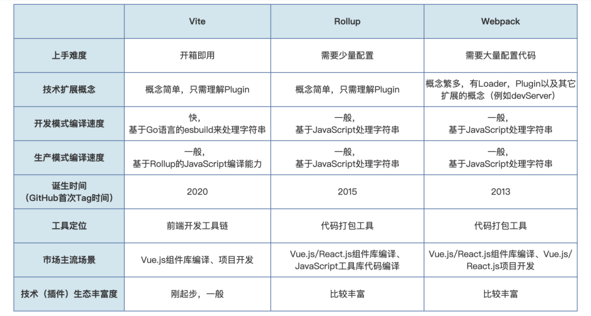

# vite 构建vue3项目

##  Rollup 开发模式的执行过程
1. 启动 Rollup 开发模式命令，Rollup 识别配置里的编译入口（input），从入口文件解析出所
有依赖代码，进行编译；
2. 编译完后启动 HTTP 开发服务，同时也继续监听源码变化；
3. 开发者用浏览器访问页面；
4. 再次修改代码，Rollup 监听到源码变化，再整体重新编译代码。

## vite 开发模式的执行过程
1. Vite 开发模式命令，VIte 启动 HTTP 服务和监听源码的变化；
2. 开发者用浏览器访问页面；
3. Vite 根据访问页面引用的 ESM 类型的 JavaScript 文件进行查找依赖，并将依赖通过
esbuild 编译成 ESM 模块的代码，保存在 node_modules/.vite/ 目录下；
4. 浏览器的 ESM 加载特性会根据页面依赖到 ESM 模块自动进行按需加载。
  a. 再次修改代码，再次访问页面，会自动执行 ESM 按需加载，同时触发依赖到的变更文件
  重新单独编译；
  b. 修改代码只会触发刷新页面，不会直接触发代码编译，而且源码编译是浏览器通过 ESM
  模块加载访问到对应文件才进行编译的；
  c. 开发模式下因为项目源码是通过 esbuild 编译，所以速度比 Rollup 快，同时由于是按页
  面里请求依赖进行按需编译，所以整体打包编译速度理论上是比 Rollup 快一些。

  